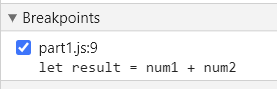
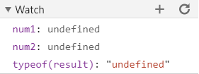
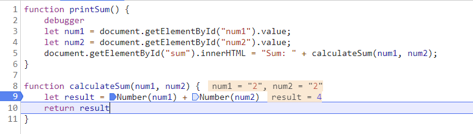

# DevTools - Debugging
## Screenshots

- 
- 

1. What was the bug?
    - The data type of `result` was a string, so `num1` and `num2` were being concatenated
2. How would you fix it?
    - I explicitly cast `num1` and `num2` to numbers instead of strings.
    - 

# DevTools - Network Tab

1. `citylots.json`
2. `part2.js`
3. 11.7 MB
4. 62 ms
5. `Mozilla/5.0 (Windows NT 10.0; Win64; x64) AppleWebKit/537.36 (KHTML, like Gecko) Chrome/87.0.4280.141 Safari/537.36`
6. Apache
7. Tue, 26 Jan 2021 22:14:13 GMT
8. application/json
9. `fetchData()`